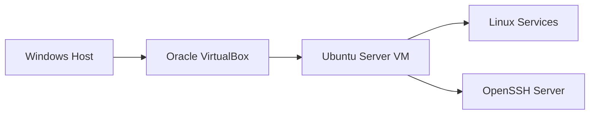

# Linux IT Support & Troubleshooting Lab

A hands-on Ubuntu Server support lab featuring five documented incidents, secure SSH administration, service recovery, filesystem troubleshooting, Bash scripting, disk monitoring, and cron automation.

## Project Objective

This project simulates common problems handled by technical support, service desk, NOC, Linux support, and cloud operations teams.

Each scenario is documented as a professional support ticket containing:

- Reported problem and symptoms
- Investigation process
- Commands and supporting evidence where applicable
- Root-cause analysis
- Resolution and verification
- Security considerations
- Lessons learned

## Lab Environment

| Component | Configuration |
|---|---|
| Host operating system | Windows |
| Virtualization | Oracle VirtualBox |
| Guest operating system | Ubuntu Server 26.04.1 LTS |
| Network mode | VirtualBox NAT |
| Remote administration | OpenSSH Server |
| Primary administrator | Non-root user with `sudo` access |

## Architecture



## Troubleshooting Tickets

| Ticket | Scenario | Status |
|---|---|---|
| [TICKET-001](tickets/TICKET-001-account-recovery.md) | Recovering Linux account access | Completed |
| [TICKET-002](tickets/TICKET-002-ssh-remote-access.md) | Configuring secure remote SSH access | Completed |
| [TICKET-003](tickets/TICKET-003-ssh-service-recovery.md) | Diagnosing and restoring a failed SSH service | Completed |
| [TICKET-004](tickets/TICKET-004-file-permissions-recovery.md) | Repairing Linux file ownership and permissions | Completed |
| [TICKET-005](tickets/TICKET-005-disk-space-monitoring.md) | Diagnosing disk exhaustion and implementing automated monitoring | Completed |

## Project Outcomes

- Recovered access to an Ubuntu administrator account through recovery mode
- Configured remote SSH access through a restricted VirtualBox NAT port-forwarding rule
- Diagnosed and restored a failed OpenSSH service
- Repaired incorrect Linux file ownership and permissions
- Diagnosed a disk-capacity incident and restored available space
- Created a configurable [Bash disk-monitoring script](scripts/check-disk.sh) with logging and meaningful exit codes
- Scheduled automated monitoring with cron and verified alert and recovery behavior
- Published organized [supporting evidence](evidence/README.md) for the completed scenarios

## Skills Demonstrated

- Ubuntu Server installation and administration
- Linux user and group management
- Account recovery using recovery mode
- Password recovery and administrator-access verification
- Linux filesystem and account-database investigation
- VirtualBox configuration and NAT networking
- OpenSSH installation and administration
- Linux service diagnosis and recovery
- File ownership and permission repair
- Root-cause analysis
- Incident-style technical documentation
- Linux disk-capacity and log analysis
- Bash scripting, input validation, and exit-code handling
- Cron scheduling and automated monitoring
- Security-conscious troubleshooting

## Script Usage

The disk monitor checks a mounted filesystem against a configurable utilization threshold. It writes timestamped results to `/var/log/helpdesk-disk-monitor.log`, so it should be run with permission to write to that location.

```bash
sudo install -m 0755 scripts/check-disk.sh /usr/local/bin/check-disk.sh
sudo /usr/local/bin/check-disk.sh /mnt/helpdesk-data 80
echo $?
```

Exit codes:

| Code | Meaning |
|---|---|
| `0` | Utilization is below the threshold |
| `1` | Utilization meets or exceeds the threshold |
| `2` | Target path is not a mounted filesystem |
| `3` | Invalid input, disk-check failure, or logging failure |

## Project Status

The planned Linux support lab is complete. All five incidents have been investigated, resolved, verified, and documented. The disk-capacity scenario also includes tested Bash monitoring and scheduled cron execution.

## Security and Privacy

- No passwords, credentials, private keys, or authentication secrets are stored in this repository.
- Screenshots and command output were reviewed before publication.
- The lab operated locally using VirtualBox NAT networking.
- Intentionally broken configurations were isolated to the lab environment.
