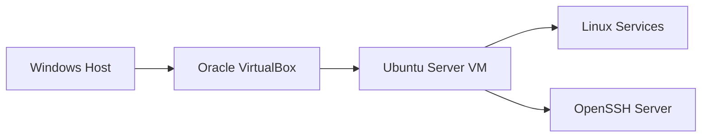

# Linux IT Support & Troubleshooting Lab

A hands-on Ubuntu Server lab demonstrating practical IT support, Linux administration, networking, access recovery, service troubleshooting, security awareness, and professional incident documentation.

## Project Objective

This project simulates common problems handled by technical support, service desk, NOC, SOC, Linux support, and cloud operations teams.

Each scenario is documented as a professional support ticket containing:

- Reported problem and symptoms
- Investigation process
- Commands and evidence
- Root-cause analysis
- Resolution and verification
- Security considerations
- Lessons learned

## Lab Environment

| Component | Configuration |
|---|---|
| Host operating system | Windows |
| Virtualization | Oracle VirtualBox |
| Guest operating system | Ubuntu Server 26.04.1 LTS |
| Network mode | VirtualBox NAT |
| Remote administration | OpenSSH Server |
| Primary administrator | Non-root user with `sudo` access |

## Architecture

## Troubleshooting Tickets

| Ticket | Scenario | Status |
|---|---|---|
| [TICKET-001](tickets/TICKET-001-account-recovery.md) | Recovering Linux account access | Completed |
| [TICKET-002](TICKET-002-ssh-remote-access.md) | Configuring secure remote SSH access | Completed |
| [TICKET-003](tickets/TICKET-003-ssh-service-recovery.md) | Diagnosing and restoring a failed SSH service | Completed |
| TICKET-004 | Repairing Linux file ownership and permissions | Planned |

## Skills Demonstrated

- Ubuntu Server installation and administration
- Linux user and group management
- Account recovery using recovery mode
- Password recovery and administrator-access verification
- Linux filesystem and account-database investigation
- VirtualBox configuration and NAT networking
- OpenSSH installation and administration
- Root-cause analysis
- Incident-style technical documentation
- Security-conscious troubleshooting

## Completed Scenario

### Recovering Linux Account Access

The original administrator username was entered incorrectly during installation. Recovery mode was used to identify the local account through `/etc/passwd`, reset access, create a correctly named administrator account, and verify its `sudo` privileges.

[Read the complete account-recovery ticket](tickets/TICKET-001-account-recovery.md).

## Project Status

This project is actively being developed. Additional SSH, service-management, networking, permissions, and troubleshooting scenarios will be added as they are completed and verified.

## Security and Privacy

- No passwords, credentials, or authentication secrets are stored in this repository.
- Screenshots and command output are reviewed before publication.
- The lab operates locally using VirtualBox NAT networking.
- Intentionally broken configurations are isolated to the lab environment.
