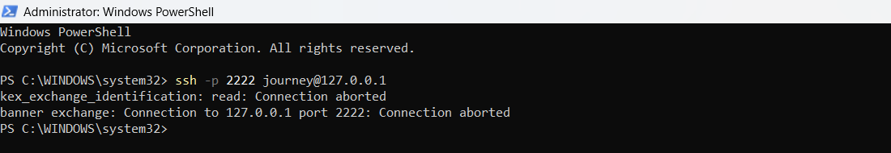
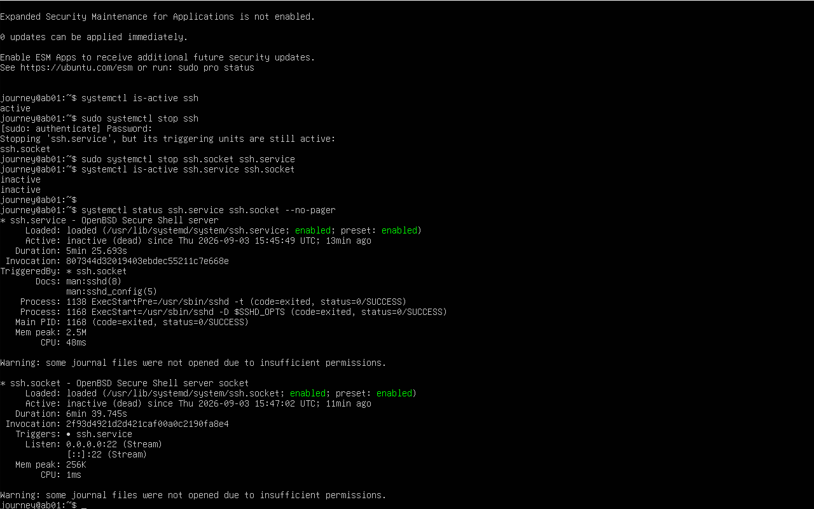
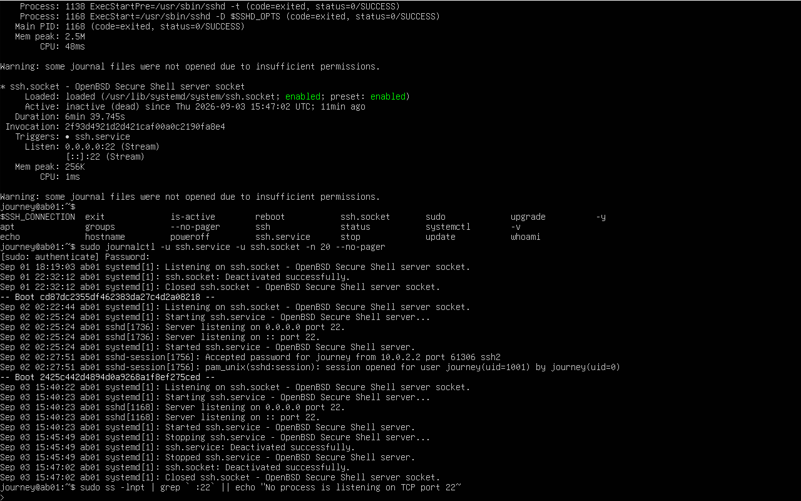
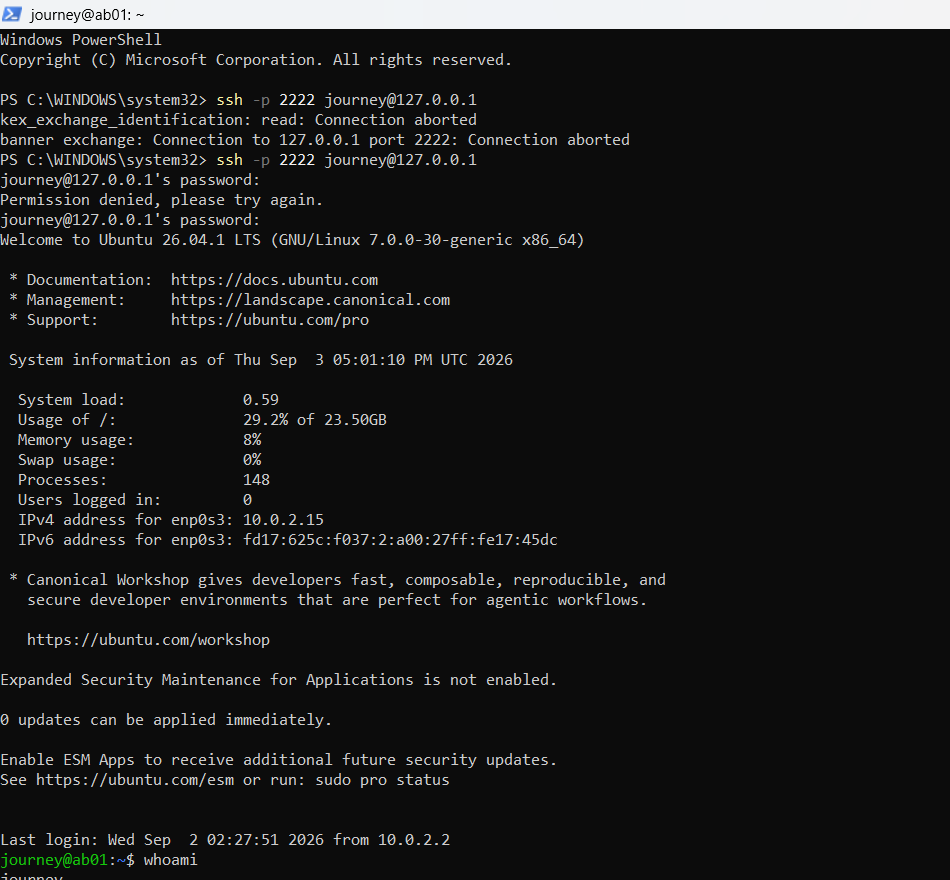

# TICKET-003: Diagnose and Restore a Failed SSH Service

## Status

Resolved

## Environment

* Windows host computer
* Oracle VirtualBox
* Ubuntu Server 26.04.1 LTS
* VirtualBox NAT networking
* OpenSSH Server
* Local administrator account: `journey`

## Reported Problem

Remote SSH access from the Windows host to the Ubuntu Server virtual machine failed.

The connection attempt used:

```powershell
ssh -p 2222 journey@127.0.0.1
```

The client reported that the connection was aborted before the SSH handshake completed.

## Initial Assessment

VirtualBox accepted the connection on forwarded host port `2222`, but the SSH service inside the Ubuntu guest was unavailable.

Ubuntu used both `ssh.service` and socket activation through `ssh.socket`. Stopping only `ssh.service` was insufficient because the socket could reactivate the service.

## Investigation

The status of both SSH units was checked:

```bash
systemctl is-active ssh.service ssh.socket
```

Both units returned:

```text
inactive
inactive
```

Detailed service information was collected:

```bash
systemctl status ssh.service ssh.socket --no-pager
```

Recent SSH logs were reviewed:

```bash
sudo journalctl -u ssh.service -u ssh.socket -n 20 --no-pager
```

Listening network ports were inspected:

```bash
sudo ss -lntp
```

No process was listening on TCP port `22` while the incident was active.

## Root Cause

Remote access failed because both `ssh.service` and its socket-activation unit, `ssh.socket`, were inactive. Therefore, no SSH process was available to complete the connection.

Pre-restart validation also detected that the runtime directory `/run/sshd` was missing.

## Resolution

The missing SSH runtime directory was recreated with appropriate permissions:

```bash
sudo install -d -m 0755 /run/sshd
```

The SSH configuration was validated before restarting the service:

```bash
sudo sshd -t && echo "SSH configuration syntax is valid"
```

The validation completed successfully.

Both SSH units were then started:

```bash
sudo systemctl start ssh.socket ssh.service
```

## Verification

Both units were confirmed active:

```bash
systemctl is-active ssh.service ssh.socket
```

Results:

```text
active
active
```

The port inspection confirmed that SSH was listening on TCP port `22` for IPv4 and IPv6.

Remote access was tested again from Windows:

```powershell
ssh -p 2222 journey@127.0.0.1
```

The connection succeeded. The remote session was verified with:

```bash
whoami
hostname
echo $SSH_CONNECTION
```

Results confirmed:

* Authenticated user: `journey`
* Remote hostname: `ab01`
* SSH destination port: `22`
* Connection originated through the VirtualBox NAT network

## Evidence

### Failed SSH Connection



### Inactive SSH Units



### Diagnostic Evidence



### Restored SSH Connection



## Security Considerations

* SSH configuration syntax was validated before restarting the service.
* The forwarded host port remained bound to `127.0.0.1`.
* Remote access used a non-root administrator account.
* No passwords or authentication secrets were recorded.
* Service and socket status were verified after recovery.

## Outcome

Secure remote SSH administration from the Windows host to the Ubuntu Server VM was restored successfully.

## Lessons Learned

* Ubuntu may use `ssh.socket` to activate `ssh.service` on demand.
* Stopping only `ssh.service` may not fully disable SSH.
* Both service state and socket state should be checked during troubleshooting.
* Logs and listening ports should be examined before restarting a failed service.
* SSH configuration should be validated before service restoration.
* Successful recovery should be verified from the original client system.
