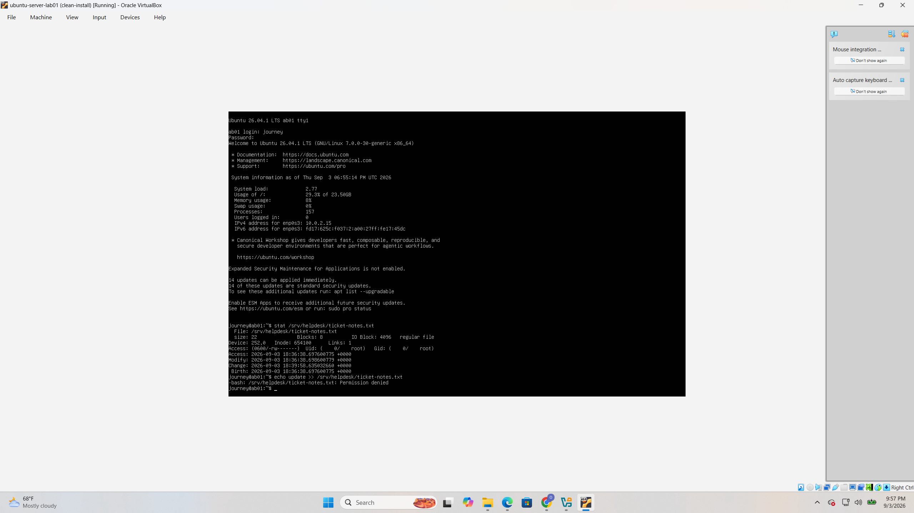
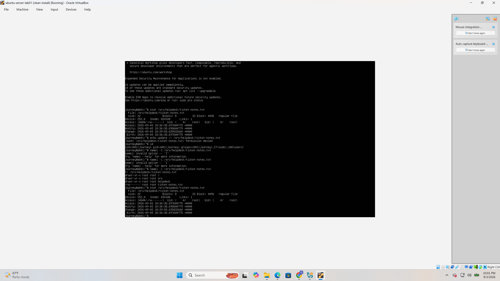
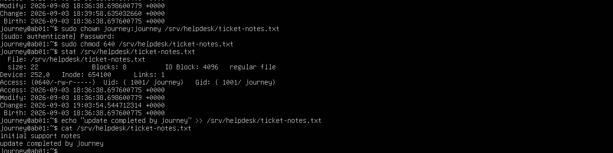

# TICKET-004: Repair Linux File Ownership and Permissions

## Status

Resolved

## Environment

* Ubuntu Server 26.04.1 LTS
* Oracle VirtualBox
* Local administrator account: `journey`
* Test file: `/srv/helpdesk/ticket-notes.txt`

## Reported Problem

The user `journey` could not update the help-desk ticket-notes file.

The following command failed:

```bash
echo update >> /srv/helpdesk/ticket-notes.txt
```

The shell returned:

```text
Permission denied
```

## Investigation

The current user and group memberships were checked:

```bash
id
```

The complete path and its permissions were examined:

```bash
namei -l /srv/helpdesk/ticket-notes.txt
```

The file metadata was inspected:

```bash
stat /srv/helpdesk/ticket-notes.txt
```

The investigation found:

* The active user was `journey`.
* Parent directories permitted directory traversal.
* The file was owned by `root:root`.
* The file permission mode was `0600`.
* Only the root user could read or modify the file.

## Root Cause

The file had incorrect ownership and overly restrictive permissions.

Because `/srv/helpdesk/ticket-notes.txt` was owned by `root:root` with mode `0600`, the intended user `journey` had no permission to read or update it.

## Resolution

Ownership was assigned to the intended user and group:

```bash
sudo chown journey:journey /srv/helpdesk/ticket-notes.txt
```

Permissions were changed to allow the owner to read and write, the group to read, and all other users to have no access:

```bash
sudo chmod 640 /srv/helpdesk/ticket-notes.txt
```

## Verification

The repaired metadata was verified:

```bash
stat /srv/helpdesk/ticket-notes.txt
```

The results confirmed:

* Owner: `journey`
* Group: `journey`
* Permission mode: `0640`
* Symbolic permissions: `rw-r-----`

The user then updated the file without using `sudo`:

```bash
echo "Update completed by journey" >> /srv/helpdesk/ticket-notes.txt
```

The file contents were displayed:

```bash
cat /srv/helpdesk/ticket-notes.txt
```

The output confirmed the update:

```text
Initial support notes
Update completed by journey
```

## Evidence

### Permission-Denied Error



### Ownership and Permission Diagnosis



### Successful Repair and Verification



## Security Considerations

* The file was not made universally writable.
* Ownership was assigned only to the intended user.
* Mode `0640` follows the principle of least privilege.
* The user’s write access was tested without granting unnecessary root access.
* No passwords or credentials were recorded.

## Outcome

The intended user regained access to the ticket-notes file. Correct ownership and least-privilege permissions were applied and verified successfully.

## Lessons Learned

* File ownership and permission mode must both be checked when diagnosing access failures.
* `namei -l` helps identify permission problems throughout an entire path.
* `stat` provides detailed ownership and permission information.
* `chown` changes file ownership, while `chmod` changes access permissions.
* Mode `0640` permits owner read/write access and group read-only access without exposing the file to other users.
* A repair should be tested using the affected user account without relying on `sudo`.
