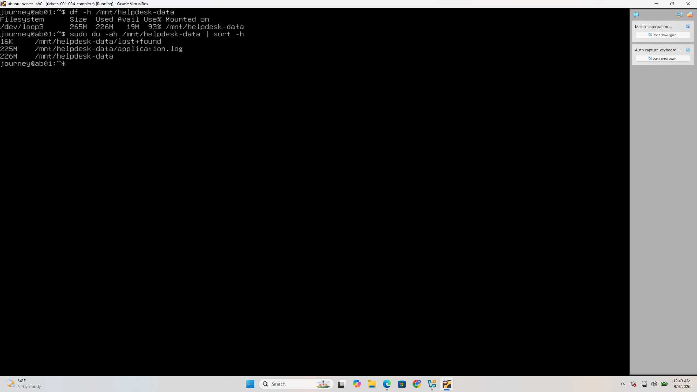
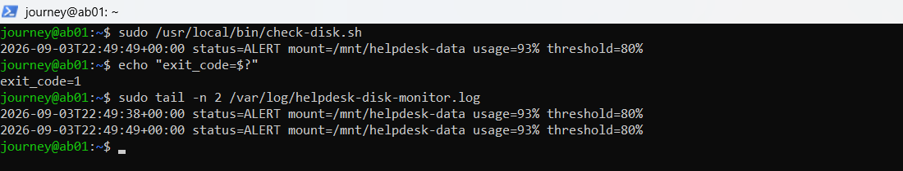
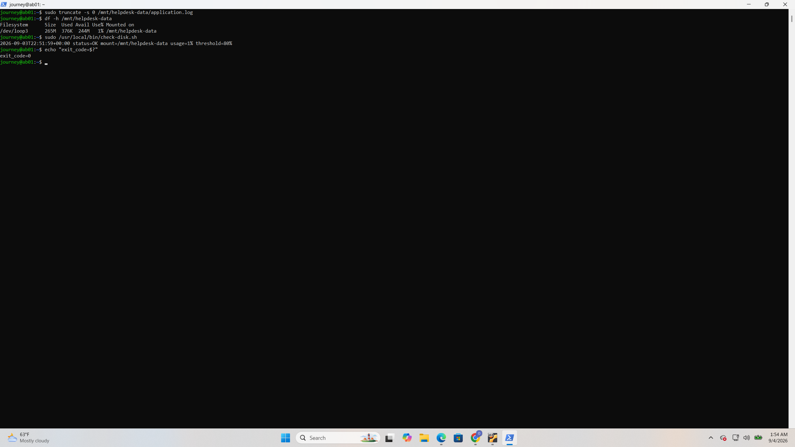
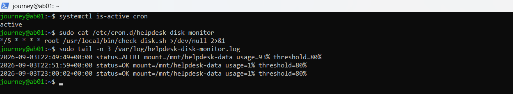

# TICKET-005: Disk-Space Incident Response and Automated Monitoring

## Ticket Summary

| Field | Details |
|---|---|
| Status | Resolved |
| Severity | High |
| System | Ubuntu Server |
| Affected filesystem | `/mnt/helpdesk-data` |
| Initial usage | 93% |
| Recovered usage | 1% |
| Root cause | Oversized `application.log` file |
| Monitoring threshold | 80% |

## Reported Problem

The application data filesystem was approaching full capacity. If left unresolved, this could prevent applications from writing logs or data and could cause service failures.

## Safety and Lab Scope

A separate 300 MB loopback filesystem was created and mounted at `/mnt/helpdesk-data`. This isolated the disk-exhaustion simulation from the operating system's root filesystem and prevented the exercise from affecting Ubuntu system files.

## Investigation

Filesystem capacity was checked with:

```bash
df -h /mnt/helpdesk-data
```

The filesystem was 93% utilized. The largest files and directories were then identified:

```bash
sudo du -ah /mnt/helpdesk-data | sort -rh | head
sudo find /mnt/helpdesk-data -type f -printf '%s %p\n' | sort -nr | head
```

The investigation identified `/mnt/helpdesk-data/application.log` as the primary consumer of disk space.



## Root Cause

An oversized application log had accumulated on the small application-data filesystem. No capacity-monitoring alert was configured, so utilization reached 93% before administrative action was taken.

## Resolution

The oversized lab log was truncated after it was identified and confirmed as safe to clear:

```bash
sudo truncate -s 0 /mnt/helpdesk-data/application.log
df -h /mnt/helpdesk-data
```

Filesystem utilization returned to 1%.


## Automated Monitoring

A Bash monitoring script was created to:

- Confirm that the target filesystem is mounted
- Read filesystem utilization with `df`
- Compare usage with a configurable threshold
- Write timestamped results to `/var/log/helpdesk-disk-monitor.log`
- Return exit code `0` for normal usage, `1` for an alert, `2` for a mount error, and `3` for invalid input or monitoring failures

The published script is available at [`scripts/check-disk.sh`](../scripts/check-disk.sh).

It was installed and tested using:

```bash
sudo install -m 0755 scripts/check-disk.sh /usr/local/bin/check-disk.sh
sudo /usr/local/bin/check-disk.sh /mnt/helpdesk-data 80
echo $?
```

To demonstrate alert behavior safely, disk usage was increased inside the isolated test filesystem and the script was run again.



After the test data was cleared, the script returned to an OK state.



## Scheduled Execution

The monitor was scheduled every five minutes with a root cron entry:

```cron
*/5 * * * * root /usr/local/bin/check-disk.sh /mnt/helpdesk-data 80 >/dev/null 2>&1
```

The cron configuration and resulting log output were verified.



## Verification

The following results confirmed successful recovery and monitoring:

- Filesystem utilization decreased from 93% to 1%
- The monitor reported `ALERT` when usage met or exceeded 80%
- The monitor reported `OK` after disk space was restored
- Timestamped entries were written to the monitoring log
- Cron executed the monitor automatically every five minutes

## Security Considerations

- The failure was simulated only on an isolated loopback filesystem.
- The operating system's root filesystem was not intentionally filled.
- The log was inspected before truncation.
- The scheduled job used an explicit script path and numeric threshold.
- Only administrative users can write to the system monitoring log and cron configuration.
- No passwords, tokens, or authentication secrets were recorded.

## Lessons Learned

Disk-capacity incidents should be addressed through both remediation and prevention. Identifying and clearing the immediate source restores service, while threshold monitoring, logging, and scheduled execution provide earlier warning of recurrence.
